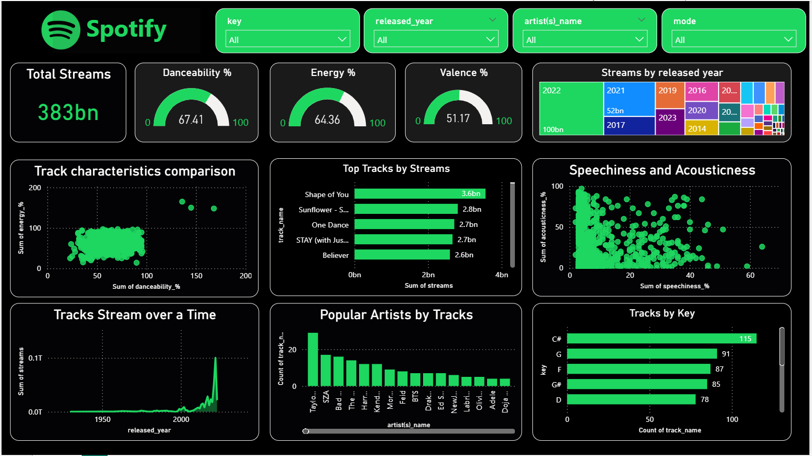

**Spotify Streaming Analytics Dashboard**

**Project Overview**

This project is an interactive Power BI dashboard developed to analyze Spotify streaming data and music track performance. The dashboard provides insights into streaming trends, artist popularity, audio characteristics, and track engagement metrics.

**Tools & Technologies Used**

Power BI
Power Query
DAX
Excel

**Dashboard Features**

KPI cards for Total Streams, Danceability, Energy, and Valence. 
Interactive slicers for Year, Artist, Key, and Mode. 
Trend analysis of streams over time. 
Top streamed tracks and popular artist analysis. 
Scatter plot analysis for speechiness and acousticness. 
Dynamic filtering and interactive visualizations. 

**Key Insights**
Identified top-performing tracks based on streaming count. 
Analyzed music characteristics such as danceability and energy. 
Compared artist popularity and release year trends. 
Observed listener behavior patterns using audio feature analysis. 

**Dashboard Preview**

